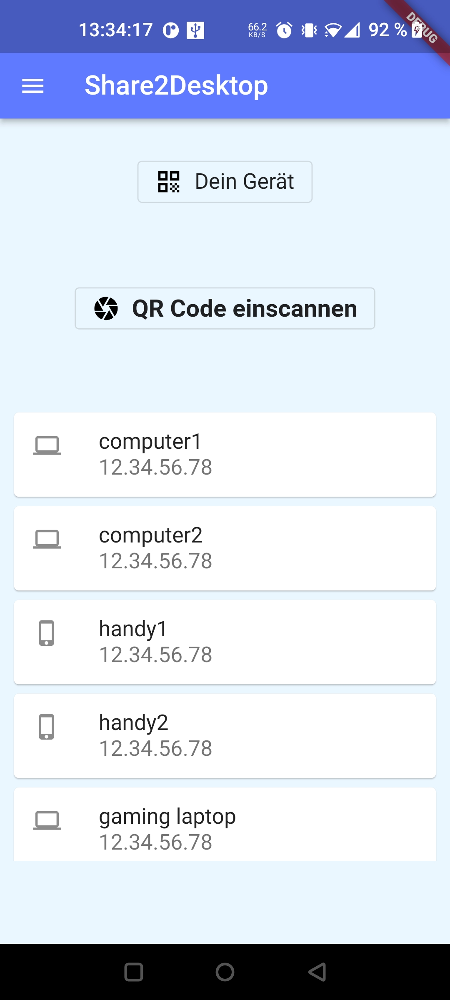
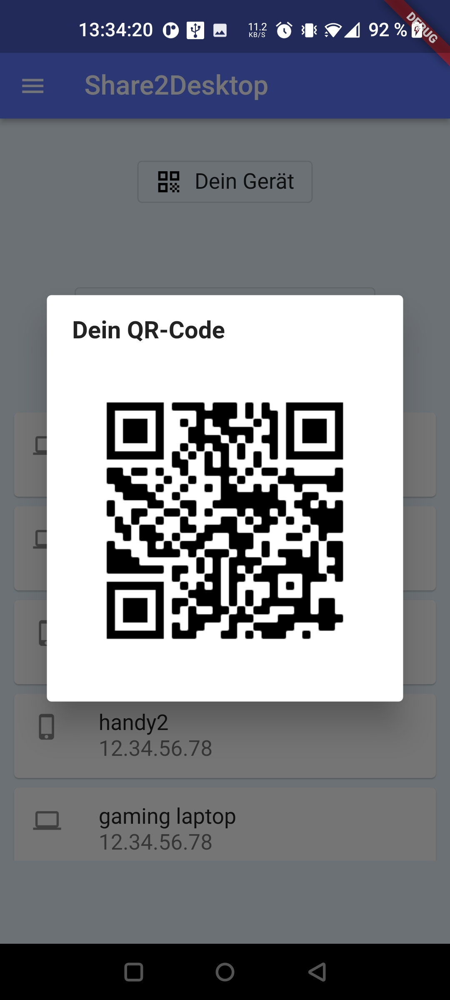
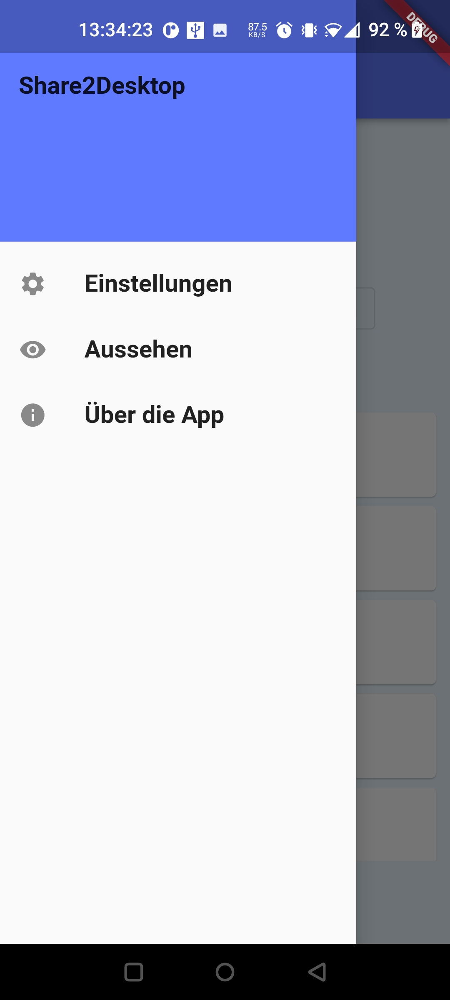
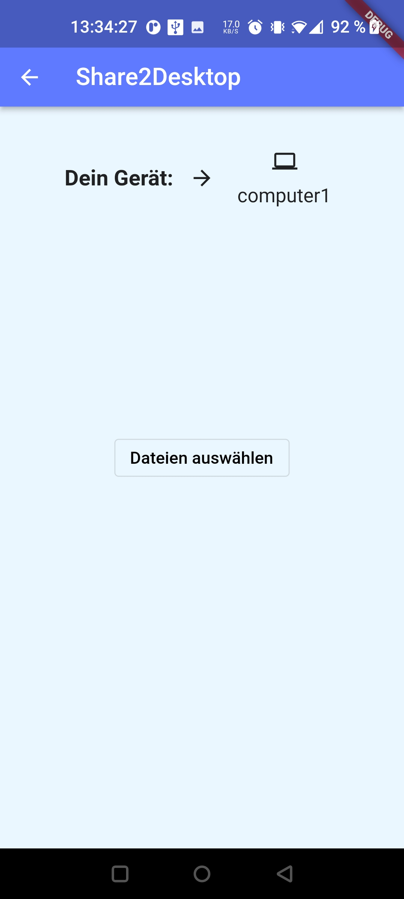
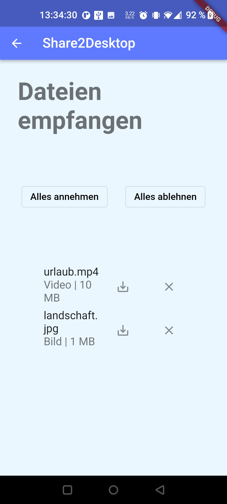

# Share2Desktop

"Share2Desktop" soll eine App sein, die das einfache Senden von Daten zwischen IOS, Android, Mac und Windows ermöglicht. Dabei dürfen keine Daten in Geräten von Dritten gespeichert werden. Deshalb soll es durch eine direkte Verbindung zwischen den Geräten funktionieren. Dieser Ansatz wird eine sichere und schnelle Übertragung garantieren. Die App soll im Play Store und auf einer Website verfügbar sein.

